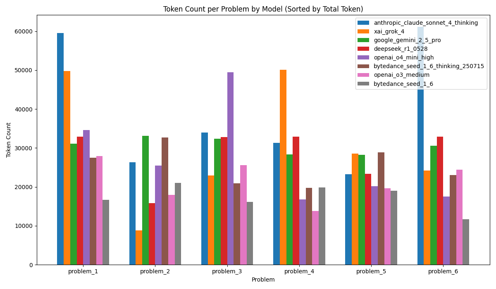
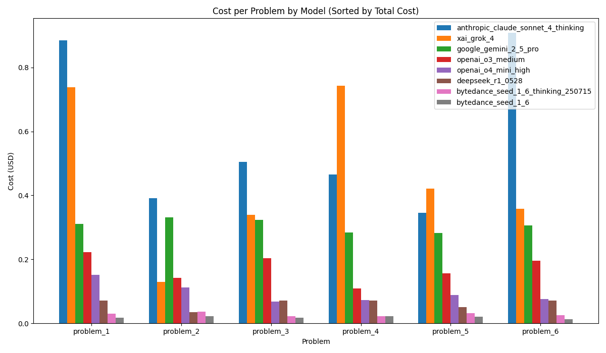

 # IMO2025-LLM

This repo is a collection and evaluation of solutions to the 2025 International Mathematical Olympiad (IMO) problems, with a focus on large language model (LLM) performance. It includes the official IMO 2025 problems, detailed solutions and reasoning generated by various LLMs, and a structured evaluation of their correctness and completeness.

## Conclusion

Only two models, Bytedance Seed 1.6 and Google Gemini 2.5 Pro, answered Problem 5 both correctly and completely.

## Model Evaluation Visualizations

**Token Count per Problem**

**Cost per Problem**

## Usage

You can use this repository to:
- Review the IMO 2025 problems and their solutions by different LLMs.
- Extend the dataset with new models or additional analysis.

## Inference Parameters

- **OpenAI models (o3-medium, o4-mini-high):** Used the response API with default parameters.
- **Deepseek R1:** Used official recommended parameters: `temperature=0.6`, `top_p=0.95`.
- **All other models:** Used `temperature=0`, `top_p=1`.

## Problem Sources

- [Problem 1](https://artofproblemsolving.com/community/c6t1881404f6h3609787_sunny_lines)
- [Problem 2](https://artofproblemsolving.com/community/c6t1881404f6h3609790_imo_2025_p2)
- [Problem 3](https://artofproblemsolving.com/community/c6t1881404f6h3609789_bonza_functions)
- [Problem 4](https://artofproblemsolving.com/community/c6t360f6h3611033_next_term_is_sum_of_three_largest_proper_divisors)
- [Problem 5](https://artofproblemsolving.com/community/c6h3610486_the_inekoalaty_game)
- [Problem 6](https://artofproblemsolving.com/community/c6t1881404f6h3610487_i_miss_turbo)

